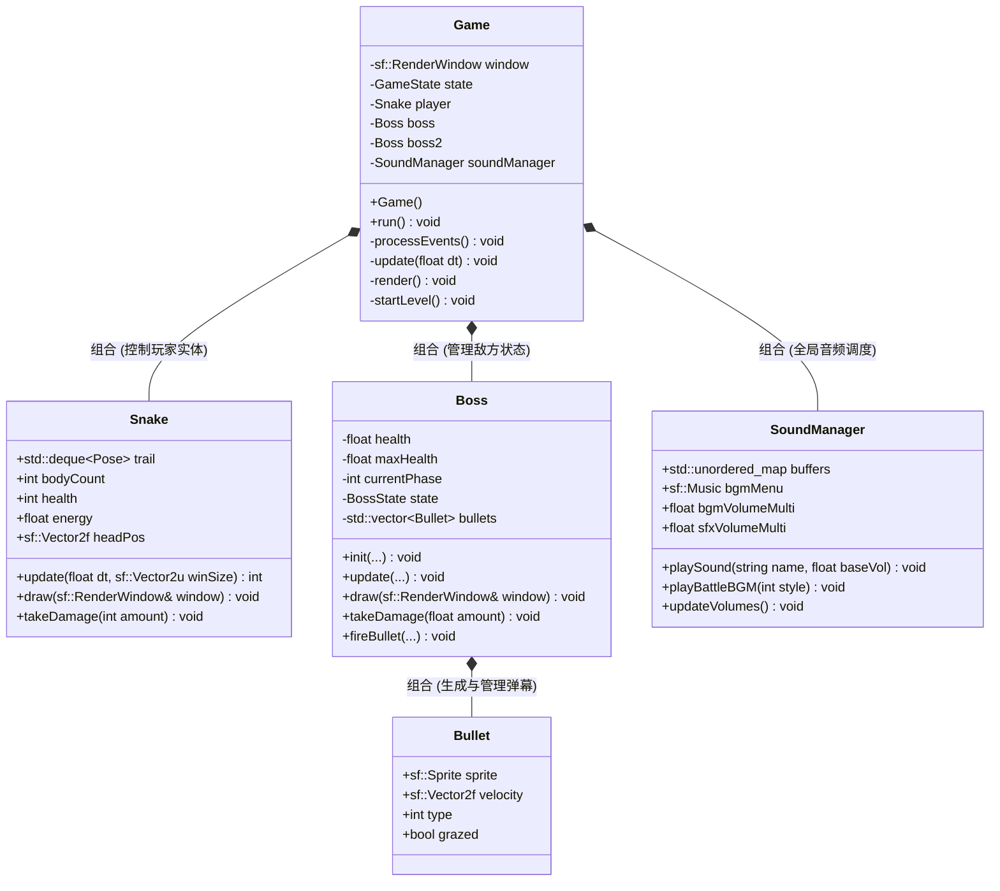

a cpphomework
**work with Gemini**

## **项目报告在游戏玩法介绍之后**


# Last Command - Modded | 最后指令 - 改版

这是一项基于 **C++** 和 **SFML 3.x** 开发的 2D 动作弹幕游戏（STG）。本项目深度融合了“贪吃蛇”的成长机制与“弹幕射击”的动作性，致敬并模仿了原作《Last Command》的核心体验。

---

## 🎮 基础控制与核心玩法 (Controls & Gameplay)

| 按键 | 功能 | 详细描述 |
| :--- | :--- | :--- |
| `↑` `↓` `←` `→` | 移动 | 控制自机（蛇头）的移动方向。 |
| `Space` (长按) | 聚焦减速 | 牺牲速度换取走位精度，移速大幅降低。 |
| `D` (长按) | 解析模式 | 蓄力攻击。体长越长，蓄力越快。蓄力满自动锁定攻击。 |
| `L-Shift` / `F` | 冲刺 | 瞬间位移，附带 **0.4s** 的无敌帧。 |
| `Q` | 冲击波 | 消耗能量，生成扩张圆环，震碎接触到的所有敌方弹幕。 |
| `Esc` | 暂停/设置 | 呼出暂停菜单，可实时调整中/英语言与音量。 |

---

## 🐍 玩家内部数据设定 (Player Entity Stats)

### 1. 基础属性
* **生命值 (HP)**：初始 3 点，上限 5 点。
* **移动速度**：基础 `239.6` | 聚焦减速 `82.9` | 冲刺 `1290.2`。
* **能量系统 (Energy)**：上限 100 点，每秒自动恢复 `12` 点。每次释放冲击波 (Q) 消耗 `35` 点。
* **冲刺充能**：上限 2 次，每消耗 1 次需等待 `2.5s` 冷却恢复。

### 2. 特殊机制
* **屏幕穿梭 (Screen Wrap)**：玩家触碰屏幕边缘并向外移动时，可从屏幕另一侧穿出。
    * **冷却时间**：`15s`。
    * **惩罚**：冷却期间撞墙会触发强制减速，且屏幕四周闪烁蓝色高亮警告框。
* **断尾求生 (Tail Cut)**：
    * 敌方子弹击中蛇头或前两节身体，扣除 `1` 点 HP。
    * 敌方子弹击中第 3 节及之后的身体，**不扣血**，但会直接切断受击点之后的所有数据尾巴。
    * **穿透属性**：敌方子弹击中尾巴后**不会消失**，如果走位失误，子弹会像电锯一样连续切割身体。
* **数据散落 (Data Drop)**：无论是掉血还是断尾，丢失的额外数据节数会以 **60%（向上取整）** 的比例转化为橙色数据点散落在周围 40px~100px 的随机范围内，玩家可重新拾取。

### 3. 解析与伤害公式 (Parsing & Damage Math)
* **解析触发条件**：当前总长度 $\ge 3$。
* **解析速度**：基础解析速度为 `30%/s`。第 3 节之后，每多 1 节额外数据，解析速度增加 `15%/s`。
* **自动锁定**：解析达到 100% 瞬间，子弹会自动计算并死锁**当前距离玩家最近的 Boss**，且带有制导追踪（基础初速度 `400`，最大追踪速度 `700`）。
* **伤害倍率**：消耗的数据量 $n = \text{总长度} - 2$。
    * 当 $n \le 3$ 时：单发伤害 $= n \times 6$。
    * 当 $n > 3$ 时：单发伤害 $= n \times 10$ （极大鼓励长尾巴极限输出）。

---

## 👾 敌方机制与攻击设定 (Boss Mechanics)

### 1. 全局与通用设定
* **阶段血量 (HP per Phase)**：简单模式 `35` | 正常模式 `65` | 困难模式 `100`。
* **阶段划分**：每个 Boss 均有 3 个阶段 (Phase 0, 1, 2)，每次血条归零进入下一阶段，血量回满。
* **普通弹幕发射频率**：根据难度动态调整：困难 `0.16s` | 正常 `0.24s` | 简单 `0.36s`。
* **普通弹幕形态**：
    * *Phase 0*：360度环形螺旋扩散弹幕，子弹速度 `180`。
    * *Phase 1*：十字型四向风车弹幕，每次旋转 18°，子弹速度 `220`。
    * *Phase 2*：双螺旋交叉弹幕，每次旋转 35°，子弹速度 `280`。
* **环境特攻 (急速泡泡)**：
    * 触发间隔：全局每 `20s` 触发一次。
    * 生成数量：`2 + 当前阶段数`。
    * 机制：从屏幕四周随机边缘刷出，贯穿屏幕。红线预警 `0.8s`，预警宽度 `50px`，泡泡飞行极速 `1800`。
    * **防重叠判定**：同一批次的泡泡出生点强制相距 $\ge 80px$，绝不重叠秒杀玩家。

### 2. Boss 1：静态核心 - Honest (蓝色)
* **本体碰撞半径 (Hitbox)**：`35.f`。
* **特攻 A (天降水晶)**：
    * 触发间隔：每 `10s` 触发一次。
    * 生成数量：`3 + 当前阶段数`。
    * 机制：在屏幕顶端生成垂直向下的红线预警，预警 `1.5s` 后子弹以 `500` 的速度砸下。预警线宽度 `30px`，出生点横向防重叠距离 $\ge 80px$。
* **特攻 B (预判狙击三连发)**：
    * 触发机制：开局延迟 `15s` 后触发，此后每 `12s` 触发一轮。
    * 攻击模式：每轮发射 3 发高速狙击水晶，每发间隔 `1.0s`。
    * **预判逻辑**：每次瞄准的不仅是玩家当前位置，而是**玩家头部位置 + (当前运动方向 $\times$ 100px)**。
    * 参数：预警宽度 `30px`，预警 `1.5s`，子弹速度 `650`。

### 3. Boss 2：移动标靶 - Hime (红色)
* **本体碰撞半径 (Hitbox)**：`45.f`（受击面积更大）。
* **特攻 A (水平巨扇)**：
    * 触发间隔：每 `12s` 触发一次。
    * 生成数量：`2 + 当前阶段数`。
    * 机制：从屏幕左右两侧随机生成水平红线，预警 `1.5s` 后巨大扇子以 `600` 的速度横扫屏幕。预警宽度高达 `130px`，出生点纵向防重叠距离 $\ge 80px$。
* **特攻 B (三向扇子散射)**：
    * 触发机制：每 `12s` 触发一次。
    * 攻击模式：一发精准锁定玩家躯干中心；另外两发强制在主炮轴线的 **+35°** 和 **-35°** 方向同时发射，形成大面积封锁。
    * 参数：预警宽度 `130px`，预警 `1.5s`，子弹速度 `650`。

### 4. Level 3 专属逻辑：双生核心联动 (Dual Core Logic)
在第三关中，两位 Boss 会同时在场，并根据阶段叠加产生复杂的阵型走位：
* **Phase 0 (换位)**：每 `15s` 触发一次换位。Boss 移动轨迹采用 Cosine 平滑插值，在 `2.0s` 内互换左右位置。
* **Phase 1 (正弦波悬浮)**：双 Boss 在 y 轴上呈反相的 Sine 正弦波上下浮动（振幅 `150px`，周期 `4.0s`）。
* **Phase 2 (四角巡航)**：采用 `24s` 的大周期循环。双 Boss 在屏幕四个角落呈矩形轨迹顺时针/逆时针移动，移动过程采用二阶平滑插值（Smoothstep），在角落停留输出。

### 5. 精确碰撞半径字典 (Collision Radius Dictionary)
冲击波消除以及玩家受击判定，严格遵守视觉贴图大小：
* 普通弹幕 (Bullet01/02)：`12.f`
* 玩家追踪子弹 (解析发射)：`18.f`
* 急速泡泡 (Bubble)：`25.f`
* Honest 竖向水晶特攻：`15.f`
* Hime 巨型扇子特攻：`65.f`

---

## 🛠️ 开发者调试模式 (Developer Debug Mode)

在游玩状态 (`Playing`) 下，可随时按下以下按键进行测试与调试：

* `F1`：**强制秒杀**。瞬间清空在场所有 Boss 当前阶段的血量。
* `F2`：**时空减速 (子弹时间)**。按下后全局时间流逝速度 `timeScale` 降为 **0.25x**。再次按下恢复 1.0x。
* `F3`：**状态重置**。玩家生命值瞬间回满至 5 滴血，并播放回血音效。
* `F4`：**数据注入**。强行给蛇增加 1 节尾巴数据（无视拾取），最高不超过 10 节。
* `F5`：**全屏清场**。强行 `clear()` 清空场上所有敌方子弹以及尚未发射的**红线预警区**，并以玩家为中心释放一次免费的清场冲击波。

---

## 💀 死亡与复活机制 (Death & Revive System)

当 HP 归零触发 Game Over 后，不再是单纯的重新开始，提供两种友好的复活选择：
1.  **当前状态复活 (Revive: Current State)**：
    * 原地满血（3点 HP）复活，赋予 `3.0s` 极长无敌时间。
    * 释放一次全屏冲击波清空周围弹幕。
    * **保留**当前 Boss 的血量、阶段和时间轴进度。
2.  **阶段重置复活 (Revive: Restart Phase)**：
    * 满血复活，所有玩家数据清零，场上掉落物清空。
    * 强制将所有 Boss 重置回**当前所在阶段的初始状态**（包括满血、初始站位、重置所有大招的计时器）。

- **C++ 标准**: C++20 及以上。
- **依赖库**: SFML 3.x (由于 SFML 3 取消了 `sf::Uint8` 等自定义类型，代码中已全面重构为标准库的 `std::uint8_t`，请确保您的包含路径配置正确)。
- **资产目录 (Assets)**：请确保编译后的可执行文件同级目录下存在 `assets/` 文件夹（存放贴图）以及 `Cubic.ttf`（游戏主要字体文件）。

## 💾 数据统计 (Endgame Statistics)

无论是系统崩溃 (Game Over) 还是任务完成 (Win)，结算界面都会永久记录本局的真实表现。**多次复活不会清空该数据，而是持续累加**：
* `Time (通关耗时)`：局内有效操作总时长。
* `Max Length (最大长度)`：本局游戏曾达到过的最高体长记录。
* `Damage Taken (受到伤害)`：蛇头或前两节躯干被击中导致扣血的总次数。
* `Data Lost (数据丢失)`：被切断尾巴或受击掉血导致丢失的额外数据块**总和**，直观反映玩家的“走位战损”。


# 高级语言程序设计大作业实验报告

南开大学26C++

---

## 目录 
1. [一. 作业题目](#一-作业题目) 
2. [二. 开发软件](#二-开发软件) 
3. [三. 课题要求](#三-课题要求) 
4. [四. AI工具使用披露](#四-ai工具使用披露) 
5. [五. 主要流程](#五-主要流程) 
	- [1. 整体架构](#1-整体架构) 
	- [2. 整体流程](#2-整体流程) 
	- [3. 算法或公式](#3-算法或公式) 
6. [六. 单元测试与调试](#六-单元测试与调试) 
7. [七. 收获](#七-收获)

---

## 一. 作业题目
**《最后指令 - 改版》 (Last Command - Modded) 2D 动作弹幕游戏**
本项目是一款融合了“贪吃蛇”成长机制与“弹幕射击（STG）”动作性的 C++ 图形化程序 。在游玩原作[Steam 上的 最后指令](https://store.steampowered.com/app/1487270/_/)后想要试着简单模仿制作。
玩家通过收集数据增长体长，利用“解析模式”消耗能量发起追踪攻击，挑战具有多阶段形态的强大 Boss。

## 二. 开发软件
* **开发语言**：C++ (标准 C++17/20) 
* **图形化库**：SFML 3.0.2 (Simple and Fast Multimedia Library) 
* **开发环境**：Visual Studio 2022

## 三. 课题要求
1.  **面向对象设计**：封装玩家（Snake）、敌人（Boss）及各类管理器，体现封装性与模块化。
2.  **图形化交互**：实现完整的 60 FPS 游戏循环、帧动画渲染及 UI 菜单系统 。
3.  **系统创新**：加入“屏幕穿梭”、“断尾求生”、“子弹时间”等创新机制 。

## 四. AI工具使用披露
* **AI 工具**：Gemini 3.1 Pro
* **具体用途**：协助写代码，将玩法与想法交由AI写为代码
* **使用位置**：整个项目

## 五. 主要流程


### 1. 整体架构


### 2. 整体流程
游戏采用状态机（GameState）驱动，通过 `Game` 类统筹全局生命周期：
* **主菜单 (Menu)**：处理关卡、皮肤、设置的选择逻辑。
* **战斗中 (Playing)**：
    * **输入处理**：实时捕获上下左右移动，D 键解析，Q 键冲击波。
    * **物理更新**：玩家轨迹计算（`std::deque`）、Boss 状态切换、子弹碰撞检测。
    * **碰撞机制**：区分“核心判定区”与“身体判定区”。核心受击扣除 HP，身体受击触发“断尾”而不死。
* **结算 (GameOver/Win)**：展示通关耗时、最大体长及“数据丢失”战损统计。

### 3. 算法或公式

**（1）解析伤害倍率公式**
设消耗的额外数据量为 n (n = 体长 - 2)：
* 当 n <= 3 时，单发伤害 D = n * 6。
* 当 n > 3 时，单发伤害 D = n * 10。该设计鼓励玩家在躲避弹幕的同时保持超长体长以获取爆发输出。

**（2）追踪子弹制导算法 (Homing Steering)**
```cpp
sf::Vector2f desired = target - pos;
float dist = std::hypot(desired.x, desired.y);
desired = (desired / dist) * 700.f;  // 期望速度
sf::Vector2f steer = desired - vel;  // 转向力
vel += steer * 4.0f * dt;            // 更新当前速度向量
```

**（3）Boss 平滑曲线移动 (Smoothstep)**
在第三阶段矩形换位中，使用三次方平滑插值公式：
Progress = t^2 * (3 - 2t)，其中 t 为时间进度系数。

**（4）防重叠弹幕生成逻辑**
在生成垂直水晶或急速泡泡时，通过 `std::vector` 记录已生成的原点坐标，配合 `while` 循环确保新弹幕与已有弹幕间距大于 80px。

## 六. 单元测试与调试
为了方便进行测试与调试，本项目开发了“上帝调试模式（作弊模式）”：
* **F1 (Instant Kill)**：测试阶段转换动画是否平滑衔接 。
* **F2 (Time Scale)**：将速度降至 0.25x，用于精确观察子弹穿过蛇身体时是否正确触发了断尾逻辑。

## 七. 收获
1.  学习如何使用AI辅助完成项目，如何写出正确的提示词。
2.  学习如何构建一个小型项目，从先写一个较为详尽的需求文档到通过Git上传
GitHub到发布Releases版本。
3.  学习了C++的一些其他库的使用方法。
